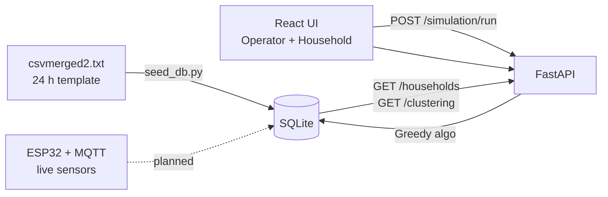

# Backend (Sprint 8 — unfinished, for friend testing)

**Greedy** simulation (Colab parity: PVGIS load/solar, P2P greedy, TOU battery). **SQLite** for simulation history, households, and hourly energy profiles.
LP, Hybrid, and in-app TOPSIS comparison are **planned** — not implemented yet.

## Database (Phase 1 — seeded)

SQLite file: `backend/solarkapitbahay.db`

On startup the API auto-seeds from `data/csvmerged2 (1).txt` if the database is empty:

| Table | Rows (seeded) | Purpose |
|-------|---------------|---------|
| `barangays` | 1 | Barangay Mabini, Davao pilot |
| `community_batteries` | 1 | 22.5 kWh shared LiFePO₄ |
| `households` | 15 | HH-01 … HH-15 |
| `datasets` | 1 | `rural_davao_energy_dataset_v2` |
| `hourly_energy_records` | 360 | 15 HH × 24 h profiles |
| `simulation_runs` | — | Greedy run history (on demand) |

**Re-seed manually:**
```powershell
cd backend
python seed_db.py          # skip if already seeded
python seed_db.py --force  # wipe Phase 1 tables and re-import
```

**API routes:**
- `GET /api/households` — all seeded households
- `GET /api/households/HH-01` — household detail
- `GET /api/dataset` — active dataset metadata
- `GET /api/clustering` — K-means (reads DB when seeded, else CSV)
- `POST /api/simulation/run` — Greedy simulation + save run

**Full schema & ERD:** [`docs/DATABASE_SCHEMA.md`](../docs/DATABASE_SCHEMA.md) · ERD image: [`docs/solarkapitbahay-erd.png`](../docs/solarkapitbahay-erd.png)

## Deployed demo (Supabase + Render + Vercel)

For a **persistent cloud demo** (data survives redeploys), follow [`docs/DEPLOY_DEMO.md`](../docs/DEPLOY_DEMO.md).

Set `DATABASE_URL` on Render to your Supabase PostgreSQL URI. Local dev without it still uses SQLite.

### Information flow (one page)



**Solid lines** = implemented today · **Dotted** = planned (MQTT ingest, alerts, transfers)

## Deploy options (pick one)

### Option A — Vercel Services (frontend + backend, one URL)

1. Vercel → Project Settings → **Framework Preset** → **Services**
2. Redeploy from GitHub (`main`)
3. Share your Vercel URL — friends use **Simulation → Run Simulation**

Routes on the live site:
- UI: `https://your-app.vercel.app/`
- API: `https://your-app.vercel.app/api/health`

> Requires Vercel **Services** access on your account. If deploy fails, use Option B.

### Option B — Render backend + Vercel frontend (most reliable)

1. [render.com](https://render.com) → **New Blueprint** → connect this repo → deploy `render.yaml`
2. Copy the Render API URL (e.g. `https://solarkapitbahay-api.onrender.com`)
3. Vercel → **Environment Variables** → add:
   ```
   VITE_API_URL = https://solarkapitbahay-api.onrender.com
   ```
4. Redeploy Vercel (Framework Preset can stay **Vite** for this option — use `.vercelignore` with `backend/` if needed)

## Run locally (full stack)

**Terminal 1:**
```powershell
npm run dev
```

**Terminal 2:**
```powershell
npm run dev:backend
```

Open `http://localhost:5173` → operator login → **Simulation**.

Demo login: `operator@solarkapitbahay.com` / `admin123`

## Notes for testers

- First simulation run on Render free tier may take ~30s (cold start)
- Run history on Vercel uses `/tmp` SQLite — history may reset between deployments
- Only **Greedy** runs in the app; LP/Hybrid will return 501 until added for a final comparison
- **Clustering** — `GET /api/clustering` and `GET /api/clustering/{household_id}` from `data/merged_household_dataset.csv`
