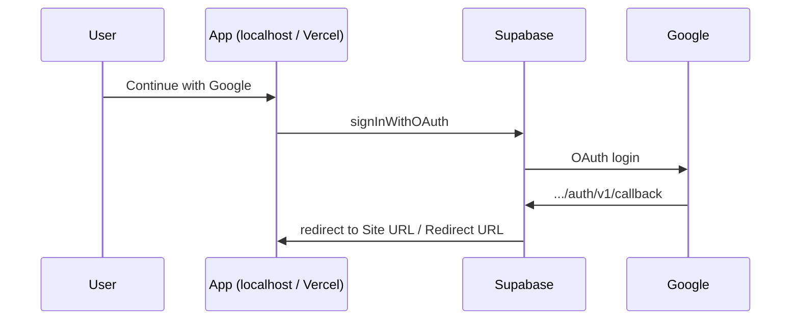
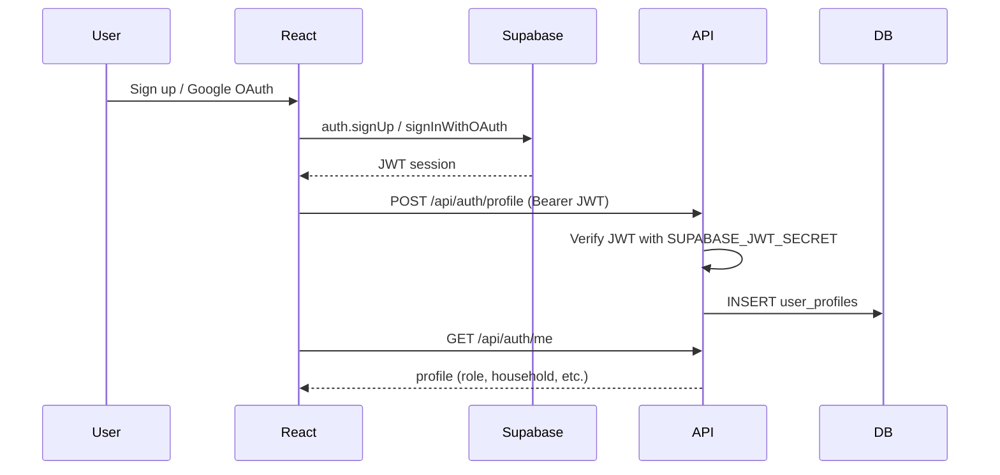

# Auth setup — Supabase + Google OAuth

Solar KapitBahay uses **Supabase Auth** for sign-up, sign-in, and Google accounts. User profiles are stored in your app database (`user_profiles` table) and linked to Supabase `auth.users` by UUID.

## 1. Supabase project

1. Create or open your project at [supabase.com](https://supabase.com).
2. Run the schema if needed: `supabase/schema.sql` (or let the FastAPI backend create tables on startup).
3. Ensure `user_profiles` exists (added in the latest schema).

## 2. Environment variables

### Frontend (Vite / Vercel)

| Variable | Where to find it |
|----------|------------------|
| `VITE_SUPABASE_URL` | Supabase → Project Settings → API → Project URL |
| `VITE_SUPABASE_ANON_KEY` | Supabase → Project Settings → API → anon public |

### Backend (FastAPI / Vercel)

| Variable | Where to find it |
|----------|------------------|
| `SUPABASE_JWT_SECRET` | Supabase → Project Settings → API → JWT Settings → JWT Secret |
| `DATABASE_URL` | Supabase pooler URI (see `docs/DEPLOY_VERCEL.md`) |

Copy values into `.env` locally and into **Vercel → Settings → Environment Variables** for production.

**Same Supabase project** powers both local dev and Vercel. You do not create a second Supabase project for production.

| Variable | Local (`.env`) | Vercel |
|----------|------------------|--------|
| `VITE_SUPABASE_URL` | Yes | Yes |
| `VITE_SUPABASE_ANON_KEY` | Yes | Yes |
| `SUPABASE_JWT_SECRET` | Yes (legacy JWT secret) | Yes |
| `DATABASE_URL` | Yes (pooler URI) | Yes (transaction pooler `:6543` recommended) |
| `VITE_API_URL` | Leave empty | Leave empty |

## 3. Google Cloud Console — OAuth setup

Google sign-in uses **one Google Cloud project** and **one Web OAuth client** for local + Vercel + Supabase.

### 3.1 Create or select a GCP project

1. [Google Cloud Console](https://console.cloud.google.com) → project dropdown → **New Project** (e.g. `Solar KapitBahay`).
2. Select that project before continuing.

### 3.2 OAuth consent screen

**Google Auth Platform** (or **APIs & Services → OAuth consent screen**):

| Setting | Value |
|---------|--------|
| User type | **External** (not Internal — Internal is Google Workspace org-only) |
| App name | Solar KapitBahay |
| Support / developer email | Your email |

**Scopes:** For login only, use defaults (`openid`, `email`, `profile`). On the Scopes step, click **Save and Continue** without adding extra APIs. Optional review: **Data Access** in the sidebar.

**Test users:** While publishing status is **Testing**, add your Gmail (and teammates) under **Audience** → test users. Only listed accounts can use Google sign-in until the app is published.

### 3.3 Create OAuth client

**Google Auth Platform → Clients** → **Create OAuth client** (or **Create OAuth client** on Overview).

| Field | Value |
|-------|--------|
| Application type | **Web application** |
| Name | `Solar KapitBahay - Supabase` |

**Authorized JavaScript origins** (your React app):

```
http://localhost:5173
https://YOUR-APP.vercel.app
```

**Authorized redirect URIs** (Supabase callback only — copy from Supabase → Authentication → Providers → Google):

```
https://YOUR_PROJECT_REF.supabase.co/auth/v1/callback
```

Do **not** put `http://localhost:5173` in Google redirect URIs; Supabase handles the OAuth callback.

After **Create**, copy **Client ID** and **Client Secret** immediately — the secret is shown only once.

### 3.4 Where credentials are stored

| Credential | Store here | Never store here |
|------------|------------|------------------|
| Client ID | Supabase → Auth → Google provider | — |
| Client Secret | Supabase → Auth → Google provider only | `.env`, git, `docs/` |
| Client ID (backup) | Google Auth Platform → **Clients** tab (retrievable) | — |
| Client Secret (lost) | Reset in Google Console → Clients → client → reset secret | — |

**Project record (fill in for your team, no secrets in git):**

| Item | Your project |
|------|----------------|
| GCP project name | _e.g. Solar KapitBahay_ |
| OAuth client name | `Solar KapitBahay - Supabase` |
| Created | _date from Google Console_ |
| Client ID | _Supabase Google provider / Clients tab_ |
| Client secret | _Supabase only — not documented_ |

### 3.5 Supabase — enable Google

1. Supabase → **Authentication** → **Providers** → **Google** → **Enable**.
2. Paste **Client ID** and **Client Secret** from step 3.3 → **Save**.

### 3.6 Supabase — URL configuration

**Authentication** → **URL Configuration**:

| Field | Values |
|-------|--------|
| **Site URL** | `http://localhost:5173` while developing, or `https://YOUR-APP.vercel.app` when live |
| **Redirect URLs** | `http://localhost:5173`, `https://YOUR-APP.vercel.app` (add both for local + Vercel) |

### 3.7 OAuth flow (reference)



## 4. Email sign-up (optional)

Supabase → **Authentication** → **Providers** → **Email**:
- Enable email provider
- Toggle **Confirm email** off for faster local testing, or leave on for production

## 5. How it works



- **Operator**: profile saved with `role = operator`, status `active`.
- **Household**: can link an existing `HH-xx` row or register as **pending** until an operator approves.

## 6. Demo mode (no Supabase)

If `VITE_SUPABASE_URL` / `VITE_SUPABASE_ANON_KEY` are not set, the login page falls back to demo accounts:

- Operator: `operator@solarkapitbahay.com` / `admin123`
- Household: preview buttons for House A / House B

## 7. API endpoints

| Method | Path | Auth | Description |
|--------|------|------|-------------|
| GET | `/api/auth/status` | No | Whether JWT validation is configured |
| GET | `/api/auth/me` | Bearer JWT | Current user profile |
| POST | `/api/auth/profile` | Bearer JWT | Create or update profile after sign-up |
| GET | `/api/barangays/lookup?code=` | No | Public barangay + claimable households |
| GET | `/api/barangays/mine` | Bearer JWT (operator) | Operator's registered barangay |
| POST | `/api/barangays/register` | Bearer JWT (operator) | Register barangay + virtual hub |
| GET | `/api/registrations` | Bearer JWT (operator) | Pending household registrations |
| PATCH | `/api/registrations/{id}/approve` | Bearer JWT (operator) | Approve household |
| PATCH | `/api/registrations/{id}/reject` | Bearer JWT (operator) | Reject household (+ email if configured) |
| GET | `/api/households?barangay_code=` | No | List households (optional filters) |

### Onboarding flow

1. **Operator** signs up → completes profile → **Barangay onboarding** wizard → receives `barangay_code` to share.
2. **Household** signs up → enters `barangay_code` → claims pre-registered home via `household_code` or list → **active**, OR registers new house → **pending** until operator approves.
3. Rejection emails use **Resend** when `RESEND_API_KEY` is set on the backend.

### Optional: Google Maps

| Variable | Purpose |
|----------|---------|
| `VITE_GOOGLE_MAPS_API_KEY` | Places Autocomplete on barangay registration |

## 8. Troubleshooting

| Issue | Fix |
|-------|-----|
| Google redirect loop | Add localhost + Vercel URLs to Supabase Redirect URLs |
| `redirect_uri_mismatch` | Google redirect URI must be exactly `https://REF.supabase.co/auth/v1/callback` |
| Access blocked / app not verified | Add your Gmail under OAuth **Audience** → test users (Testing mode) |
| Google works locally but not on Vercel | Add Vercel URL to Google **JavaScript origins** and Supabase Redirect URLs |
| `Auth not configured` on API | Set `SUPABASE_JWT_SECRET` on backend |
| `Invalid token` | Check JWT secret matches Supabase project (legacy JWT secret is correct) |
| Profile 404 after login | Complete the profile form (first-time sign-up) |
| CORS errors | Use same-domain `/api` on Vercel (`VITE_API_URL` empty) |
| Lost Google client secret | Google Auth Platform → Clients → your client → reset secret → update Supabase |
