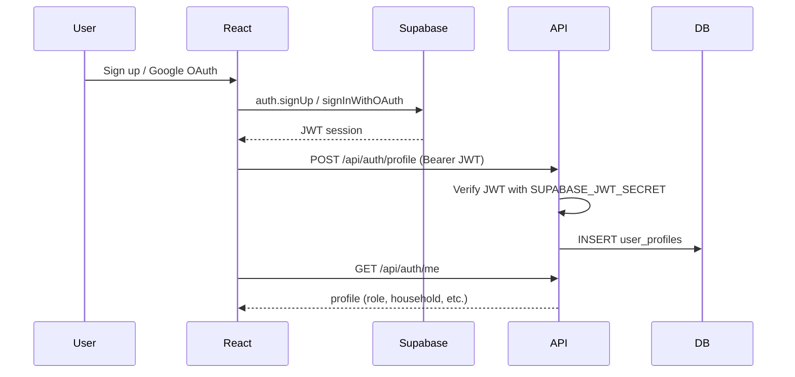

# Auth setup — Supabase + Google OAuth

Solar KapitBahay uses **Supabase Auth** for sign-up, sign-in, and Google accounts. User profiles are stored in your app database (`user_profiles` table) and linked to Supabase `auth.users` by UUID.

## 1. Supabase project

1. Create or open your project at [supabase.com](https://supabase.com).
2. Run the schema if needed: `supabase/schema.sql` (or let the FastAPI backend create tables on startup).
3. Ensure `user_profiles` exists (added in the latest schema).

## 2. Environment variables

### Frontend (Vite / Vercel)

| Variable | Where to find it |
|----------|------------------|
| `VITE_SUPABASE_URL` | Supabase → Project Settings → API → Project URL |
| `VITE_SUPABASE_ANON_KEY` | Supabase → Project Settings → API → anon public |

### Backend (FastAPI / Vercel)

| Variable | Where to find it |
|----------|------------------|
| `SUPABASE_JWT_SECRET` | Supabase → Project Settings → API → JWT Settings → JWT Secret |
| `DATABASE_URL` | Supabase pooler URI (see `docs/DEPLOY_VERCEL.md`) |

Copy values into `.env` locally and into **Vercel → Settings → Environment Variables** for production.

## 3. Enable Google sign-in

1. Supabase → **Authentication** → **Providers** → **Google** → Enable.
2. Create OAuth credentials in [Google Cloud Console](https://console.cloud.google.com/apis/credentials):
   - Application type: **Web application**
   - Authorized redirect URI (from Supabase Google provider page):
     `https://YOUR_PROJECT_REF.supabase.co/auth/v1/callback`
3. Paste **Client ID** and **Client Secret** into Supabase Google provider settings.
4. Supabase → **Authentication** → **URL Configuration**:
   - **Site URL**: your app URL (e.g. `https://your-app.vercel.app` or `http://localhost:5173`)
   - **Redirect URLs**: add the same URLs (local + production)

## 4. Email sign-up (optional)

Supabase → **Authentication** → **Providers** → **Email**:
- Enable email provider
- Toggle **Confirm email** off for faster local testing, or leave on for production

## 5. How it works

- **Operator**: profile saved with `role = operator`, status `active`.
- **Household**: can link an existing `HH-xx` row or register as **pending** until an operator approves.

## 6. Demo mode (no Supabase)

If `VITE_SUPABASE_URL` / `VITE_SUPABASE_ANON_KEY` are not set, the login page falls back to demo accounts:

- Operator: `operator@solarkapitbahay.com` / `admin123`
- Household: preview buttons for House A / House B

## 7. API endpoints

| Method | Path | Auth | Description |
|--------|------|------|-------------|
| GET | `/api/auth/status` | No | Whether JWT validation is configured |
| GET | `/api/auth/me` | Bearer JWT | Current user profile |
| POST | `/api/auth/profile` | Bearer JWT | Create or update profile after sign-up |

## 8. Troubleshooting

| Issue | Fix |
|-------|-----|
| Google redirect loop | Add your site URL to Supabase redirect URLs |
| `Auth not configured` on API | Set `SUPABASE_JWT_SECRET` on backend |
| `Invalid token` | Check JWT secret matches Supabase project |
| Profile 404 after login | Complete the profile form (first-time sign-up) |
| CORS errors | Use same-domain `/api` on Vercel (`VITE_API_URL` empty) |
