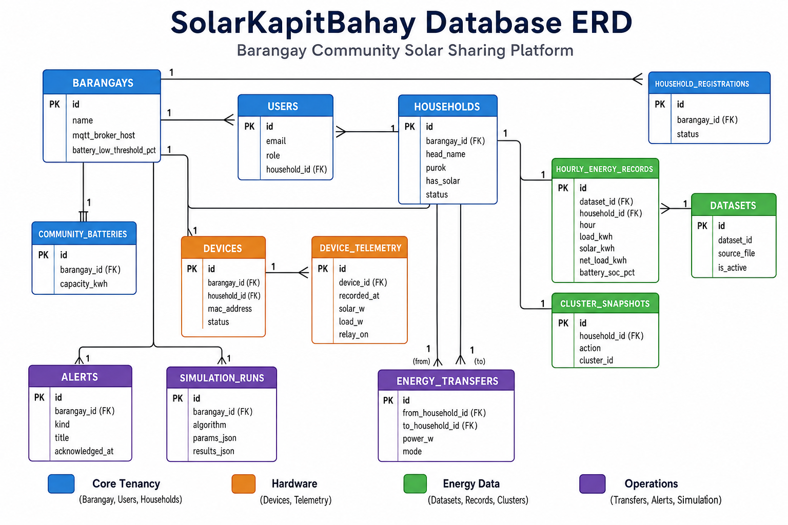
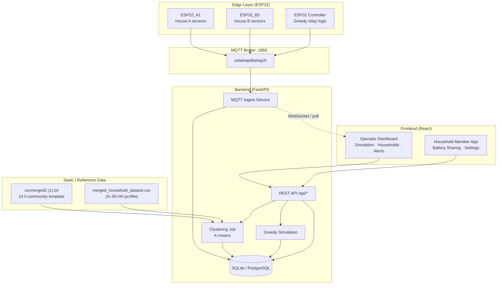
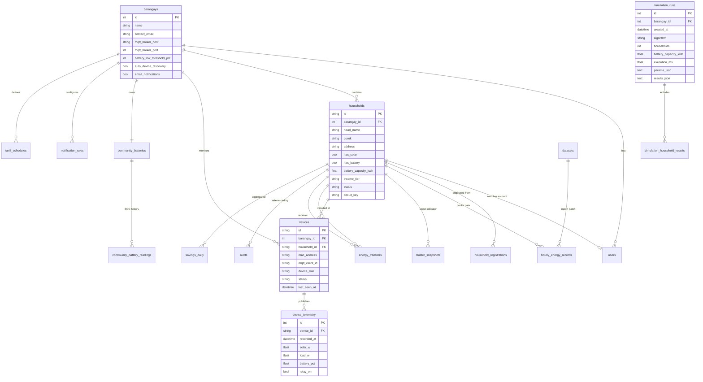

# SolarKapitBahay — Database Schema & Information Flow

**Purpose:** Showcase how data moves through the SolarKapitBahay system — from rural Davao energy datasets and ESP32 sensors, through the backend, into operator and household dashboards.

**Status:** Phase 1 implemented (`barangays`, `households`, `datasets`, `hourly_energy_records`, `community_batteries`, `simulation_runs`). Clustering reads from DB when seeded. Live telemetry, transfers, and alerts remain planned.

**ERD image:** [`solarkapitbahay-erd.png`](./solarkapitbahay-erd.png)



---

## 1. System overview

SolarKapitBahay is a **barangay-level community solar sharing platform**. Data enters the system through four channels:

| Channel | Source | Frequency | Purpose |
|---------|--------|-----------|---------|
| **Live telemetry** | ESP32 + MQTT | Every 2–5 s | Real-time solar, load, relay, community battery |
| **Household profiles** | Merged dataset (`csvmerged2`) | On import / daily | 15 HH × 24 h load/solar/SOC for clustering |
| **Simulation** | Greedy algorithm (FastAPI) | On demand | What-if planning: savings, fairness, payback |
| **User actions** | Operator / member UI | Event-driven | Registrations, transfers, alert acks, settings |



---

## 2. Information flows (by subsystem)

### Flow A — Live hardware → dashboard

```
ACS712 / voltage divider (ESP32)
  → read solar_w, load_w, battery_pct, relay
  → MQTT publish solarkapitbahay/{device_id}/telemetry
  → Backend MQTT subscriber
  → INSERT device_telemetry
  → Aggregate latest per household → community_metrics snapshot
  → GET /api/live/community  →  Operator Dashboard, Energy Transfer page
  → Greedy controller reads surplus/deficit → relay command
  → MQTT publish solarkapitbahay/{device_id}/command
```

**Tables touched:** `devices`, `device_telemetry`, `community_battery_readings`, `controller_telemetry`, `energy_transfers`, `automation_decisions`

---

### Flow B — Dataset import → clustering → household indicators

```
data/csvmerged2 (1).txt  (24 community hourly rows + metadata)
  → merged_dataset_loader.expand_to_household_rows()
  → 15 households × 24 hours
  → UPSERT hourly_energy_records
  → clustering.run_clustering()  (K-means on net_load vs SOC)
  → INSERT cluster_snapshots (latest per household)
  → GET /api/clustering  →  Dashboard scatter plot, Households page chips
  → GET /api/clustering/HH-01  →  Member battery-sharing indicator
```

**Tables touched:** `datasets`, `hourly_energy_records`, `cluster_snapshots`, `households`

---

### Flow C — Simulation planning

```
Operator sets params (households, battery kWh, days, algorithm)
  → POST /api/simulation/run
  → algorithms/greedy.simulate_greedy()
  → INSERT simulation_runs (header + JSON blobs)
  → INSERT simulation_household_results (normalized top-10 shares)
  → INSERT alerts (kind=info, "Simulation completed")
  → Response → Simulation page results cards + comparison chart
```

**Tables touched:** `simulation_runs`, `simulation_household_results`, `tariff_schedules`, `alerts`

---

### Flow D — Household onboarding

```
Member registers (email, address, has_solar, battery model)
  → INSERT household_registrations (status=pending)
  → Operator reviews Households page
  → APPROVE → INSERT households + users, UPDATE registration
  → REJECT  → UPDATE registration status=rejected
  → Optional: link device MAC → devices.household_id
```

**Tables touched:** `household_registrations`, `households`, `users`, `devices`

---

### Flow E — Energy sharing & alerts

```
Greedy algorithm OR manual operator transfer
  → INSERT energy_transfers (from_household_id, to_household_id, power_w, mode)
  → MQTT command to recipient relay
  → INSERT automation_decisions (decision text, SOC, reason)
  → Threshold rules (battery_low_threshold_pct) evaluate
  → INSERT alerts (danger / warning / info)
  → Operator ack → UPDATE alerts.acknowledged_at
```

**Tables touched:** `energy_transfers`, `automation_decisions`, `alerts`, `notification_rules`, `barangays`

---

## 3. Entity-relationship diagram



---

## 4. Table catalog

### 4.1 Core tenancy & identity

#### `barangays`
One row per deployed community (e.g. Barangay Mabini, Rural Davao pilot).

| Column | Type | Notes |
|--------|------|-------|
| `id` | INTEGER PK | |
| `name` | TEXT NOT NULL | UI: Settings → Barangay Name |
| `contact_email` | TEXT | Operator contact |
| `mqtt_broker_host` | TEXT | e.g. `192.168.1.100` |
| `mqtt_broker_port` | INTEGER DEFAULT 1883 | |
| `battery_low_threshold_pct` | INTEGER DEFAULT 20 | Triggers danger alerts |
| `auto_device_discovery` | BOOLEAN DEFAULT 1 | Energy Transfer → Scan |
| `email_notifications` | BOOLEAN DEFAULT 1 | |
| `location_lat` | REAL | From dataset: 7.1907 |
| `location_lon` | REAL | From dataset: 125.4553 |
| `timezone` | TEXT DEFAULT 'Asia/Manila' | UTC+8 |
| `created_at` | TEXT | ISO 8601 UTC |
| `updated_at` | TEXT | |

#### `users`
Operators and household members. Replaces hardcoded `demoAccounts` in `login.jsx`.

| Column | Type | Notes |
|--------|------|-------|
| `id` | INTEGER PK | |
| `barangay_id` | INTEGER FK → barangays | |
| `email` | TEXT UNIQUE NOT NULL | |
| `password_hash` | TEXT NOT NULL | bcrypt |
| `role` | TEXT CHECK | `operator` \| `household` |
| `display_name` | TEXT | e.g. "Barangay Captain" |
| `initials` | TEXT | Avatar badge |
| `household_id` | TEXT FK → households NULL | Required when role=household |
| `created_at` | TEXT | |
| `last_login_at` | TEXT | |

---

### 4.2 Household domain

#### `households`
Canonical household registry. Seeds from `merged_dataset_loader.HEAD_NAMES` and `HouseholdsPage` mock rows.

| Column | Type | Notes |
|--------|------|-------|
| `id` | TEXT PK | `HH-01` … `HH-15` |
| `barangay_id` | INTEGER FK | |
| `head_name` | TEXT | e.g. "Ramon D." |
| `purok` | TEXT | e.g. "Purok 1" |
| `address` | TEXT | Full display address |
| `has_solar` | BOOLEAN | Registration + CSV |
| `has_battery` | BOOLEAN | |
| `battery_capacity_kwh` | REAL | Per-HH; community total in `community_batteries` |
| `battery_model` | TEXT | e.g. "LiFePO4 5kWh" |
| `income_tier` | TEXT CHECK | `low` \| `mid` \| `high` |
| `status` | TEXT CHECK | `active` \| `pending` \| `inactive` |
| `circuit_key` | TEXT | `houseA` \| `houseB` — live hardware mapping |
| `circuit_name` | TEXT | "House A" — matches MQTT `house` field |
| `registered_at` | TEXT | |
| `approved_by_user_id` | INTEGER FK → users NULL | Audit trail |

#### `household_registrations`
Pending applications before operator approval (`HouseholdsPage` `pendingRegs`).

| Column | Type | Notes |
|--------|------|-------|
| `id` | TEXT PK | `REG-014` |
| `barangay_id` | INTEGER FK | |
| `applicant_name` | TEXT | |
| `applicant_email` | TEXT | From registration form |
| `address` | TEXT | |
| `has_solar` | BOOLEAN | |
| `has_battery` | BOOLEAN | |
| `battery_model` | TEXT | |
| `battery_capacity_kwh` | REAL | |
| `status` | TEXT CHECK | `pending` \| `approved` \| `rejected` |
| `submitted_at` | TEXT | |
| `reviewed_at` | TEXT | |
| `reviewed_by_user_id` | INTEGER FK | |

---

### 4.3 Hardware & live telemetry

#### `devices`
ESP32 registry (`energyTransfer.js` `initialDevices` + firmware `DEVICE_ID`).

| Column | Type | Notes |
|--------|------|-------|
| `id` | TEXT PK | `ESP32_A1`, `ESP32_B2`, `ESP32_Controller` |
| `barangay_id` | INTEGER FK | |
| `household_id` | TEXT FK NULL | NULL for controller |
| `mac_address` | TEXT | `AA:BB:CC:DD:EE:01` |
| `mqtt_client_id` | TEXT | `skb-{DEVICE_ID}-{hex}` |
| `device_role` | TEXT CHECK | `household` \| `controller` \| `display_hub` |
| `has_solar` | BOOLEAN | |
| `status` | TEXT CHECK | `online` \| `offline` |
| `last_seen_at` | TEXT | Updated on MQTT status/telemetry |
| `firmware_version` | TEXT | |

#### `device_telemetry`
Time-series from `solarkapitbahay/{device_id}/telemetry` (household ESP32s).

| Column | Type | Notes |
|--------|------|-------|
| `id` | INTEGER PK | |
| `device_id` | TEXT FK → devices | |
| `recorded_at` | TEXT NOT NULL | Indexed |
| `solar_w` | REAL | MQTT `solar_w` |
| `load_w` | REAL | MQTT `load_w` |
| `battery_pct` | REAL | MQTT `battery_pct` |
| `relay_on` | BOOLEAN | MQTT `relay` |
| `raw_json` | TEXT | Full payload for audit |

**Index:** `(device_id, recorded_at DESC)` — latest reading per device.

#### `controller_telemetry`
From `solarkapitbahay/controller/telemetry` (greedy relay controller).

| Column | Type | Notes |
|--------|------|-------|
| `id` | INTEGER PK | |
| `barangay_id` | INTEGER FK | |
| `recorded_at` | TEXT | |
| `solar_v` | REAL | |
| `solar_a` | REAL | |
| `solar_w` | REAL | |
| `relay_house_a` | BOOLEAN | `house_a` |
| `relay_house_b` | BOOLEAN | `house_b` |
| `greedy_status` | TEXT | e.g. `"ok"` |
| `raw_json` | TEXT | |

#### `community_batteries`
Static config for the shared barangay battery (metadata: 22.5 kWh for 15 HH).

| Column | Type | Notes |
|--------|------|-------|
| `id` | INTEGER PK | |
| `barangay_id` | INTEGER FK UNIQUE | One per barangay |
| `capacity_kwh` | REAL | 22.5 (dataset) or 100 (sim default) |
| `efficiency` | REAL | 0.90 (dataset) / 0.92 (sim) |
| `min_soc_pct` | REAL | 20 |
| `max_soc_pct` | REAL | 95 |
| `max_charge_kw` | REAL | 5.0 |
| `max_discharge_kw` | REAL | 5.0 |
| `battery_type` | TEXT | `LiFePO4` |

#### `community_battery_readings`
SOC history for dashboard battery organism and alerts.

| Column | Type | Notes |
|--------|------|-------|
| `id` | INTEGER PK | |
| `community_battery_id` | INTEGER FK | |
| `recorded_at` | TEXT | |
| `soc_pct` | REAL | UI `battery` field |
| `source` | TEXT | `telemetry` \| `simulation` \| `dataset` |

---

### 4.4 Energy sharing & automation

#### `energy_transfers`
Manual and automatic P2P transfers (`EnergyTransferPage` tx history).

| Column | Type | Notes |
|--------|------|-------|
| `id` | INTEGER PK | |
| `barangay_id` | INTEGER FK | |
| `from_household_id` | TEXT FK | |
| `to_household_id` | TEXT FK | |
| `power_w` | REAL | UI sends W; display as kW |
| `mode` | TEXT CHECK | `auto` \| `manual` |
| `status` | TEXT CHECK | `success` \| `failed` \| `pending` |
| `initiated_by_user_id` | INTEGER FK NULL | NULL = greedy auto |
| `started_at` | TEXT | |
| `completed_at` | TEXT | |
| `notes` | TEXT | |

#### `automation_decisions`
Greedy decision log (`energyTransfer.js` `initialAutomationLog`).

| Column | Type | Notes |
|--------|------|-------|
| `id` | INTEGER PK | |
| `barangay_id` | INTEGER FK | |
| `decided_at` | TEXT | |
| `decision_text` | TEXT | e.g. "House A → House B (100W)" |
| `soc_pct` | REAL | Community SOC at decision time |
| `reason` | TEXT | e.g. "Greedy · surplus" |
| `algorithm` | TEXT DEFAULT 'greedy' | |
| `transfer_id` | INTEGER FK → energy_transfers NULL | |

#### `transfer_mode_settings`
Operator preference for auto vs manual (per barangay).

| Column | Type | Notes |
|--------|------|-------|
| `barangay_id` | INTEGER PK FK | |
| `mode` | TEXT CHECK | `auto` \| `manual` |
| `auto_enabled` | BOOLEAN | |
| `countdown_sec` | INTEGER | Next decision timer |
| `updated_at` | TEXT | |

---

### 4.5 Alerts & notifications

#### `alerts`
Replaces `AlertsPage` `initialAlerts`.

| Column | Type | Notes |
|--------|------|-------|
| `id` | TEXT PK | `AL-001` |
| `barangay_id` | INTEGER FK | |
| `household_id` | TEXT FK NULL | e.g. HH-02 low supply |
| `device_id` | TEXT FK NULL | e.g. ESP32 offline |
| `kind` | TEXT CHECK | `danger` \| `warning` \| `info` |
| `title` | TEXT | |
| `message` | TEXT | |
| `source` | TEXT | `threshold` \| `simulation` \| `device` \| `transfer` |
| `created_at` | TEXT | |
| `acknowledged_at` | TEXT NULL | NULL = active |
| `acknowledged_by_user_id` | INTEGER FK NULL | |

#### `notification_rules`
Per-barangay toggles (Alerts page sidebar).

| Column | Type | Notes |
|--------|------|-------|
| `id` | INTEGER PK | |
| `barangay_id` | INTEGER FK | |
| `rule_key` | TEXT | `excess_capacity` \| `min_supply` \| `simulation_done` |
| `label` | TEXT | Display name |
| `enabled` | BOOLEAN | |

---

### 4.6 Dataset & hourly profiles

#### `datasets`
Tracks imported reference files.

| Column | Type | Notes |
|--------|------|-------|
| `id` | INTEGER PK | |
| `dataset_id` | TEXT UNIQUE | `rural_davao_energy_dataset_v2` |
| `source_file` | TEXT | Path to txt/csv |
| `household_count` | INTEGER | 15 |
| `hourly_rows` | INTEGER | 24 |
| `location` | TEXT | |
| `imported_at` | TEXT | |
| `is_active` | BOOLEAN | One active dataset per barangay |

#### `hourly_energy_records`
Normalized rows from `merged_household_dataset.csv` / txt expansion.

| Column | Type | Notes |
|--------|------|-------|
| `id` | INTEGER PK | |
| `dataset_id` | INTEGER FK | |
| `household_id` | TEXT FK | |
| `hour` | INTEGER | 0–23 |
| `load_kwh` | REAL | |
| `solar_kwh` | REAL | |
| `net_load_kwh` | REAL | Clustering X-axis |
| `battery_soc_pct` | REAL | Clustering Y-axis |
| `grid_import_kwh` | REAL | |
| `grid_export_kwh` | REAL | |
| `tou_period` | TEXT | `off_peak` \| `mid_peak` \| `peak` |
| `tou_rate_php` | REAL | |

**Unique:** `(dataset_id, household_id, hour)`

#### `community_hourly_template`
The 24-row community template from `csvmerged2 (1).txt` (before per-HH expansion).

| Column | Type | Notes |
|--------|------|-------|
| `id` | INTEGER PK | |
| `dataset_id` | INTEGER FK | |
| `hour` | INTEGER | |
| `hour_label` | TEXT | |
| `solar_ghi_mean_wm2` | REAL | |
| `solar_power_kw` | REAL | |
| `load_base_kw` | REAL | |
| `load_min_kw` | REAL | |
| `load_max_kw` | REAL | |
| `net_power_kw` | REAL | |
| `tou_period` | TEXT | |
| `tou_rate_php` | REAL | |
| `cumulative_load_kwh` | REAL | |
| `cumulative_solar_kwh` | REAL | |

---

### 4.7 Clustering (derived analytics)

#### `cluster_snapshots`
Cached K-means output — one latest row per household per run.

| Column | Type | Notes |
|--------|------|-------|
| `id` | INTEGER PK | |
| `household_id` | TEXT FK | |
| `dataset_id` | INTEGER FK | |
| `computed_at` | TEXT | |
| `cluster_id` | INTEGER | |
| `action` | TEXT CHECK | `charge` \| `discharge` \| `balanced` |
| `net_load_kwh_avg` | REAL | scatter_x |
| `battery_soc_pct_avg` | REAL | scatter_y |
| `grid_import_kwh_avg` | REAL | |
| `load_kwh_avg` | REAL | |
| `solar_kwh_avg` | REAL | |
| `sample_count` | INTEGER | Usually 24 |

**API mapping:** `GET /api/clustering` reads latest snapshot per household.

---

### 4.8 Simulation (planning)

#### `simulation_runs` *(exists today)*
| Column | Type | Notes |
|--------|------|-------|
| `id` | INTEGER PK | ✅ implemented |
| `barangay_id` | INTEGER FK | **add** — currently global |
| `created_at` | TEXT | ✅ |
| `algorithm` | TEXT | ✅ `greedy` only |
| `households` | INTEGER | ✅ |
| `battery_capacity_kwh` | REAL | ✅ |
| `execution_ms` | REAL | ✅ |
| `params_json` | TEXT | ✅ full request body |
| `results_json` | TEXT | ✅ full greedy output |

#### `simulation_household_results` *(new — normalize JSON)*
Top household shares from `household_comparison` array.

| Column | Type | Notes |
|--------|------|-------|
| `id` | INTEGER PK | |
| `run_id` | INTEGER FK → simulation_runs | |
| `household_id` | TEXT | `HH-01` (synthetic index) |
| `share_pct` | REAL | 0–100 |
| `rank` | INTEGER | 1–10 |

#### `simulation_summary` *(optional denormalized view)*
Key metrics extracted from `results_json` for dashboard queries.

| Column | Type |
|--------|------|
| `run_id` | INTEGER PK FK |
| `total_savings_php` | REAL |
| `monthly_savings_php` | REAL |
| `solar_generated_kwh` | REAL |
| `grid_reduction_pct` | REAL |
| `energy_shared_kwh` | REAL |
| `gini_coefficient` | REAL |
| `hardware_cost_php` | REAL |
| `payback_months` | REAL NULL |
| `simulation_days` | INTEGER |

---

### 4.9 Tariffs & aggregates (charts)

#### `tariff_schedules`
Replaces hardcoded `config.py` / enables Settings overrides.

| Column | Type | Notes |
|--------|------|-------|
| `id` | INTEGER PK | |
| `barangay_id` | INTEGER FK NULL | NULL = system default |
| `hour` | INTEGER | 0–23 |
| `period` | TEXT | `off_peak` \| `mid_peak` \| `peak` |
| `grid_rate_php` | REAL | |
| `shared_rate_php` | REAL DEFAULT 11.0 | |
| `export_rate_php` | REAL DEFAULT 5.0 | |

#### `savings_daily`
Powers dashboard line charts (currently hardcoded arrays).

| Column | Type | Notes |
|--------|------|-------|
| `id` | INTEGER PK | |
| `barangay_id` | INTEGER FK | |
| `household_id` | TEXT FK NULL | NULL = community total |
| `date` | TEXT | `YYYY-MM-DD` |
| `savings_php` | REAL | |
| `solar_kwh` | REAL | |
| `grid_reduction_pct` | REAL | |
| `co2_offset_kg` | REAL | |

#### `peak_hour_comparison`
6–9 PM with/without sharing bars on dashboards.

| Column | Type | Notes |
|--------|------|-------|
| `id` | INTEGER PK | |
| `barangay_id` | INTEGER FK | |
| `date` | TEXT | |
| `hour_label` | TEXT | `6PM` … `9PM` |
| `grid_draw_kwh_without` | REAL | |
| `grid_draw_kwh_with` | REAL | |

---

## 5. Enums reference

| Domain | Values | Used in |
|--------|--------|---------|
| `user.role` | `operator`, `household` | login, RBAC |
| `household.status` | `active`, `pending`, `inactive` | Households page |
| `household.income_tier` | `low`, `mid`, `high` | CSV, clustering |
| `registration.status` | `pending`, `approved`, `rejected` | Onboarding |
| `device.status` | `online`, `offline` | MQTT + Energy Transfer |
| `device.device_role` | `household`, `controller`, `display_hub` | Firmware |
| `cluster.action` | `charge`, `discharge`, `balanced` | Clustering API |
| `alert.kind` | `danger`, `warning`, `info` | Alerts page |
| `transfer.mode` | `auto`, `manual` | Energy Transfer |
| `transfer.status` | `success`, `failed`, `pending` | Tx history |
| `simulation.algorithm` | `greedy` (+ `lp`, `hybrid` planned) | Simulation |
| `tou.period` | `off_peak`, `mid_peak`, `peak` | Dataset |

---

## 6. API → table mapping

| Endpoint | Reads | Writes |
|----------|-------|--------|
| `GET /api/health` | — | — |
| `POST /api/simulation/run` | `tariff_schedules`, `community_batteries` | `simulation_runs`, `simulation_household_results`, `alerts` |
| `GET /api/simulation/runs` | `simulation_runs` | — |
| `GET /api/simulation/runs/{id}` | `simulation_runs`, `simulation_household_results` | — |
| `GET /api/clustering` | `cluster_snapshots`, `households` | — |
| `GET /api/clustering/{id}` | `cluster_snapshots`, `hourly_energy_records` | — |
| `GET /api/households` *(planned)* | `households`, `cluster_snapshots` | — |
| `POST /api/registrations` *(planned)* | — | `household_registrations` |
| `PATCH /api/registrations/{id}` *(planned)* | `household_registrations` | `households`, `users` |
| `GET /api/live/community` *(planned)* | `device_telemetry`, `community_battery_readings` | — |
| `GET /api/transfers` *(planned)* | `energy_transfers` | — |
| `POST /api/transfers` *(planned)* | `devices` | `energy_transfers`, `automation_decisions` |
| `GET /api/alerts` *(planned)* | `alerts` | — |
| `PATCH /api/alerts/{id}/ack` *(planned)* | `alerts` | `alerts.acknowledged_at` |
| `GET/PUT /api/settings` *(planned)* | `barangays`, `notification_rules` | `barangays` |
| MQTT ingest *(planned)* | — | `device_telemetry`, `controller_telemetry`, `devices.status` |

---

## 7. DDL starter (SQLite)

```sql
-- ── Core ──────────────────────────────────────────────────────────
CREATE TABLE barangays (
    id                      INTEGER PRIMARY KEY AUTOINCREMENT,
    name                    TEXT NOT NULL,
    contact_email           TEXT,
    mqtt_broker_host        TEXT,
    mqtt_broker_port        INTEGER DEFAULT 1883,
    battery_low_threshold_pct INTEGER DEFAULT 20,
    auto_device_discovery   INTEGER DEFAULT 1,
    email_notifications     INTEGER DEFAULT 1,
    location_lat            REAL,
    location_lon            REAL,
    timezone                TEXT DEFAULT 'Asia/Manila',
    created_at              TEXT NOT NULL,
    updated_at              TEXT
);

CREATE TABLE households (
    id                      TEXT PRIMARY KEY,
    barangay_id             INTEGER NOT NULL REFERENCES barangays(id),
    head_name               TEXT NOT NULL,
    purok                   TEXT,
    address                 TEXT,
    has_solar               INTEGER DEFAULT 0,
    has_battery             INTEGER DEFAULT 0,
    battery_capacity_kwh    REAL,
    battery_model           TEXT,
    income_tier             TEXT CHECK (income_tier IN ('low','mid','high')),
    status                  TEXT NOT NULL DEFAULT 'active'
                            CHECK (status IN ('active','pending','inactive')),
    circuit_key             TEXT,
    circuit_name            TEXT,
    registered_at           TEXT,
    approved_by_user_id     INTEGER
);

CREATE TABLE users (
    id                      INTEGER PRIMARY KEY AUTOINCREMENT,
    barangay_id             INTEGER NOT NULL REFERENCES barangays(id),
    email                   TEXT NOT NULL UNIQUE,
    password_hash           TEXT NOT NULL,
    role                    TEXT NOT NULL CHECK (role IN ('operator','household')),
    display_name            TEXT,
    initials                TEXT,
    household_id            TEXT REFERENCES households(id),
    created_at              TEXT NOT NULL,
    last_login_at           TEXT
);

-- ── Telemetry ─────────────────────────────────────────────────────
CREATE TABLE devices (
    id                      TEXT PRIMARY KEY,
    barangay_id             INTEGER NOT NULL REFERENCES barangays(id),
    household_id            TEXT REFERENCES households(id),
    mac_address             TEXT,
    mqtt_client_id          TEXT,
    device_role             TEXT CHECK (device_role IN ('household','controller','display_hub')),
    has_solar               INTEGER DEFAULT 0,
    status                  TEXT DEFAULT 'offline' CHECK (status IN ('online','offline')),
    last_seen_at            TEXT,
    firmware_version        TEXT
);

CREATE TABLE device_telemetry (
    id                      INTEGER PRIMARY KEY AUTOINCREMENT,
    device_id               TEXT NOT NULL REFERENCES devices(id),
    recorded_at             TEXT NOT NULL,
    solar_w                 REAL,
    load_w                  REAL,
    battery_pct             REAL,
    relay_on                INTEGER,
    raw_json                TEXT
);
CREATE INDEX idx_telemetry_device_time ON device_telemetry(device_id, recorded_at DESC);

-- ── Dataset & clustering ────────────────────────────────────────────
CREATE TABLE datasets (
    id                      INTEGER PRIMARY KEY AUTOINCREMENT,
    dataset_id              TEXT NOT NULL UNIQUE,
    source_file             TEXT,
    household_count         INTEGER,
    hourly_rows             INTEGER,
    location                TEXT,
    imported_at             TEXT NOT NULL,
    is_active               INTEGER DEFAULT 1
);

CREATE TABLE hourly_energy_records (
    id                      INTEGER PRIMARY KEY AUTOINCREMENT,
    dataset_id              INTEGER NOT NULL REFERENCES datasets(id),
    household_id            TEXT NOT NULL REFERENCES households(id),
    hour                    INTEGER NOT NULL CHECK (hour BETWEEN 0 AND 23),
    load_kwh                REAL,
    solar_kwh               REAL,
    net_load_kwh            REAL,
    battery_soc_pct         REAL,
    grid_import_kwh         REAL,
    grid_export_kwh         REAL,
    tou_period              TEXT,
    tou_rate_php            REAL,
    UNIQUE (dataset_id, household_id, hour)
);

CREATE TABLE cluster_snapshots (
    id                      INTEGER PRIMARY KEY AUTOINCREMENT,
    household_id            TEXT NOT NULL REFERENCES households(id),
    dataset_id              INTEGER NOT NULL REFERENCES datasets(id),
    computed_at             TEXT NOT NULL,
    cluster_id              INTEGER,
    action                  TEXT CHECK (action IN ('charge','discharge','balanced')),
    net_load_kwh_avg        REAL,
    battery_soc_pct_avg     REAL,
    grid_import_kwh_avg     REAL,
    load_kwh_avg            REAL,
    solar_kwh_avg           REAL,
    sample_count            INTEGER
);

-- ── Simulation (extend existing) ──────────────────────────────────
-- simulation_runs already exists; add barangay_id via migration
CREATE TABLE simulation_household_results (
    id                      INTEGER PRIMARY KEY AUTOINCREMENT,
    run_id                  INTEGER NOT NULL REFERENCES simulation_runs(id),
    household_id            TEXT NOT NULL,
    share_pct               REAL,
    rank                    INTEGER
);

-- ── Operations ────────────────────────────────────────────────────
CREATE TABLE energy_transfers (
    id                      INTEGER PRIMARY KEY AUTOINCREMENT,
    barangay_id             INTEGER NOT NULL REFERENCES barangays(id),
    from_household_id       TEXT NOT NULL REFERENCES households(id),
    to_household_id         TEXT NOT NULL REFERENCES households(id),
    power_w                 REAL,
    mode                    TEXT CHECK (mode IN ('auto','manual')),
    status                  TEXT CHECK (status IN ('success','failed','pending')),
    initiated_by_user_id    INTEGER REFERENCES users(id),
    started_at              TEXT NOT NULL,
    completed_at            TEXT
);

CREATE TABLE alerts (
    id                      TEXT PRIMARY KEY,
    barangay_id             INTEGER NOT NULL REFERENCES barangays(id),
    household_id            TEXT REFERENCES households(id),
    device_id               TEXT REFERENCES devices(id),
    kind                    TEXT NOT NULL CHECK (kind IN ('danger','warning','info')),
    title                   TEXT NOT NULL,
    message                 TEXT,
    source                  TEXT,
    created_at              TEXT NOT NULL,
    acknowledged_at         TEXT,
    acknowledged_by_user_id INTEGER REFERENCES users(id)
);
```

---

## 8. Current state vs target

| Area | Today | Target |
|------|-------|--------|
| Auth | Demo accounts in `login.jsx` | `users` table + JWT sessions |
| Households | 2 mock rows + local state | `households` + `household_registrations` |
| Live data | `useLiveData()` random mock | `device_telemetry` ← MQTT ingest |
| Clustering | Reads CSV on every request | `hourly_energy_records` + `cluster_snapshots` cache |
| Simulation | `simulation_runs` only | + `simulation_household_results`, link to `alerts` |
| Transfers | React `useState` | `energy_transfers` + `automation_decisions` |
| Alerts | Hardcoded array | `alerts` + `notification_rules` |
| Settings | Toast only | `barangays` persisted |
| Charts | Static arrays in pages | `savings_daily`, `peak_hour_comparison` |

---

## 9. Recommended implementation phases

| Phase | Scope | Unblocks |
|-------|-------|----------|
| **1 — Foundation** ✅ | `barangays`, `households`, `datasets`, `hourly_energy_records`, seed from `csvmerged2` | Clustering from DB, `GET /api/households` |
| **2 — Analytics cache** | `cluster_snapshots`, clustering job on import | Faster `/api/clustering`, dashboard scatter |
| **3 — Simulation normalize** | `simulation_household_results`, `barangay_id` on runs | Save/Load simulation history UI |
| **4 — Operations** | `household_registrations`, `alerts`, `notification_rules` | Registration workflow, Alerts page |
| **5 — Live edge** | `devices`, `device_telemetry`, MQTT ingest, `GET /api/live` | Real dashboard, Energy Transfer |
| **6 — Transfers & aggregates** | `energy_transfers`, `savings_daily`, `peak_hour_comparison` | Full P2P history, chart APIs |

---

## 10. Seed data mapping (Rural Davao pilot)

From `data/csvmerged2 (1).txt` metadata:

```
barangays.name          = "Barangay Mabini" (or "Rural Davao Pilot")
barangays.location      = 7.1907°N, 125.4553°E
community_batteries     = 22.5 kWh, LiFePO4, 90% efficiency
households              = HH-01 … HH-15 (HEAD_NAMES in merged_dataset_loader.py)
hourly_energy_records   = 15 × 24 = 360 rows after expansion
devices                 = ESP32_A1 → HH-01/House A, ESP32_B2 → HH-02/House B
tariff_schedules        = off_peak 8.99, mid_peak 10.58, peak 12.70 (hours from config.py)
```

---

*This document is the canonical schema reference for SolarKapitBahay. Update it when tables or flows change.*
